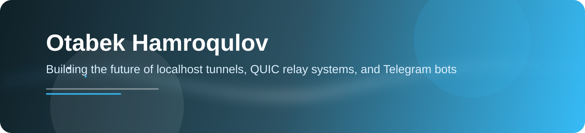

  
   
  
   
  
  

## About me

- 🚇 Building [trqsh](https://trqsh.uz), a localhost tunneling service and relay platform over QUIC/HTTP-3 with a Go backend and a Python package on PyPI.
- 🤖 Creating Telegram bots for anonymous messaging, price tracking, and mini apps.
- 🛠️ Working across Go, Python, TypeScript, Node.js, Docker, Linux, Git, PostgreSQL, and Redis.

  
  
   
  
   
  
   
  
   
  <picture>
    <source media="(prefers-color-scheme: dark)" srcset="https://raw.githubusercontent.com/Hamroqulovv/Hamroqulovv/output/github-contribution-grid-snake-dark.svg" />
    <source media="(prefers-color-scheme: light)" srcset="https://raw.githubusercontent.com/Hamroqulovv/Hamroqulovv/output/github-contribution-grid-snake.svg" />
    
  </picture>
   
  

  

